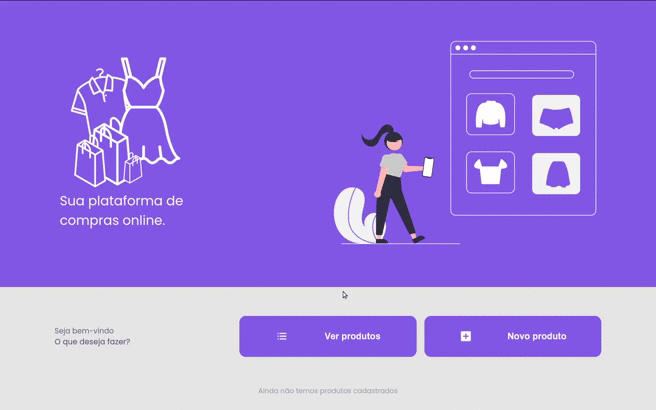

## 💻️ CRUD-PHP

<div align="center">
    
</div>


## 📑 Sobre

Aplicação web desenvolvido com a finalidade de construir um CRUD em PHP

- Layout Responsivo


## 👨‍💻 Tecnologias 

O projeto foi desenvolvido utilizando:

- PHP
- HTML
- CSS
- JavaScript

## ⬇ Como baixar o projeto

```bash

    #Clonar o Repositório (Via Terminal)
    $ git clone https://github.com/xpedroleonardo/CRUD-PHP.git

    #Ou

    #Botão verde acima (Zip)
    Baixar projeto compactado

```


## 🚀 Como executar o projeto

Ápós baixar o projeto, execute os seguintes passos: 

```bash

    #Entrar na pasta do projeto
    $ cd CRUD-PHP/

    #Instalar as depedências 
    $ php composer.phar install

```

## 👨‍🔧️ Configurações


### Banco de Dados
O banco de dados está localizado na raiz do projeto, é necessário vc criar ele antes de rodar o projeto.


### Conexão com o Banco
Acesse o arquivo <strong>src/Config.php</strong>, e altere a constante de conexão (<strong>DATA_LAYER_CONFIG</strong>), conforme o seu banco de dados


### Constante Raiz (BASE URL)
Também no arquivo <strong>src/Config.php</strong>, e altere a constante <strong>ROOT</strong>, conforme está no seu localhost, de forma que não tenha uma <strong>/</strong> no final.<br/>
Exemplo: http://localhost/CRUD-PHP


## ⚠ Atenção !!!

Como o projeto utiliza PHP, será necessário ter um servidor [local](http://localhost), para executar o projeto.

Coloque a pasta do projeto onde ficam os arquivos no seu servidor local.

Após isso, acesse http://localhost e explore o projeto.

---

### 💻 Feito por [Pedro Leonardo](https://github.com/xpedroleonardo). 

### Gostou do projeto ? De uma estrela ⭐
